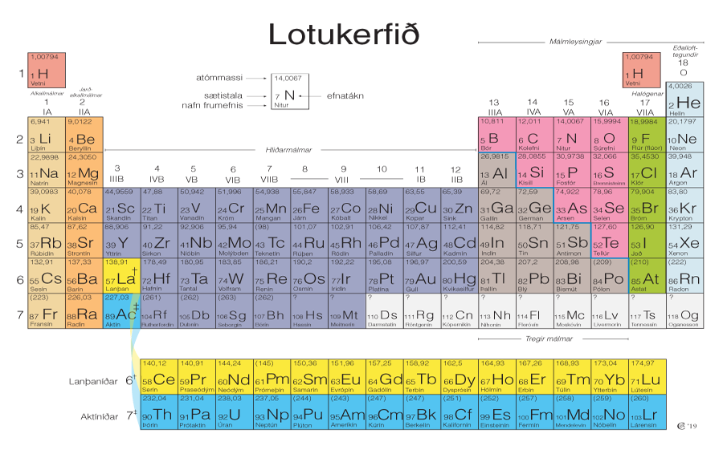
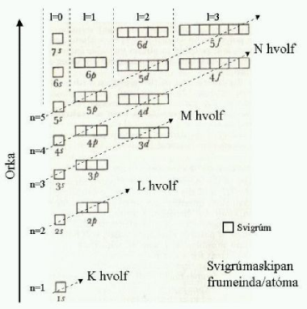
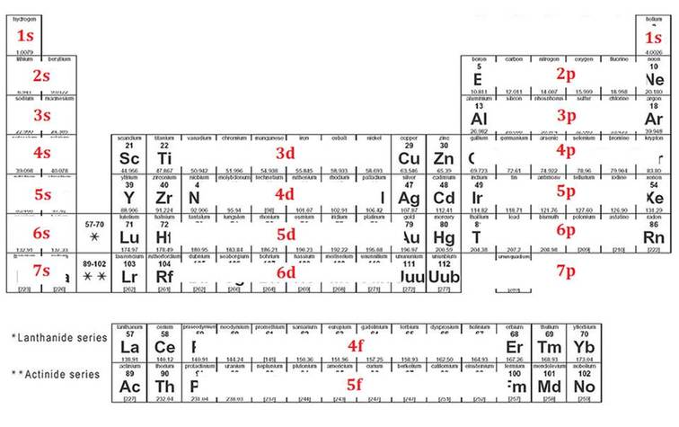

Frumefni
====

Í efnafræði er efni skilgreint sem svo að það hefur massa og tekur upp pláss, þ.e. hefur rúmmál. *Atóm* er örsmá grunneining sem allt efni í alheiminum er búið til úr. Eins og staðan er núna
eru til 118 þekktar tegundir atóma, þar sem hver tegund telst sem eitt *frumefni*. Atóm, þó örsmá, eru ekki minnsta eining efnis, þar sem þau eru gerð úr jákvætt hlöðnum *róteindum* (e. `proton <https://en.wikipedia.org/wiki/Proton>`__), neikvætt hlöðnum *rafeindum* (e. `electron <https://en.wikipedia.org/wiki/Electron>`__) og  hleðslulausum *nifteindum* (e. `neutron <https://en.wikipedia.org/wiki/Neutron>`__).
Róteindir og nifteindir mynda *kjarna* (e. `nucleus <https://en.wikipedia.org/wiki/Atomic_nucleus>`__) atómsins meðan rafeindirnar sveima kringum kjarnan[VANTAR MYND].

Frumefni eru hleðslulaus og hafa því jafnan fjölda af róteindum og rafeindum, en fjöldi þeirra ákvarðar gerð frumefnis. Frumefni getur þó haft mismunandi fjölda nifteinda í kjarna og myndað
þannig mismunandi *samsætur* (e. `isotopes <https://en.wikipedia.org/wiki/Isotope>`__). Samsætur hafa mismunandi *massatölu*, en massatala er samanlagður fjöldi nifteinda og róteinda. Massi rafeindar er svo lítill
miðað við hinar tvær öreindirnar að ekki þarf að taka tillit til þeirra. Samsætur eru svo nefndar eftir massatölu sinni, s.s. C-13 hefur massatöluna 13.

.. tip::
  **Hver er fjöldi nifteinda, róteinda og rafeinda í C-13?**

  Kolefni hefur sætistöluna 6, og hefur því 6 róteindir og rafeindir. Nú er jafnan fyrir massatölu:

  .. math::
     A=Z+N

  þar sem A er massatalan, Z er fjöldi róteinda, og N er fjöldi nifteinda.
  Þá má sjá að fyrir massatölu 13 og 6 róteindir fæst að það eru 7 nifteindir í C-13

Lotukerfið
----------
Fyrsta lotukerfið (e. The Periodic Table) var smíðað af `Mendeleev <https://en.wikipedia.org/wiki/Dmitri_Mendeleev>`__ árið 1869, þar sem frumefnunum var raðað eftir sætistölu (e. `atomic number <https://en.wikipedia.org/wiki/Atomic_number>`__), þ.e. fjölda róteinda. Þeim var svo hópað saman eftir efnafræðilegum eiginleikum. Þó svo að ekki hafi öll frumefnin
verið fundin, tókst Mandeleev að mestu leyti að áætla hvar vantaði frumefni, með því að tengja sætistöluna við eiginleika frumefnisins. Einungis fyrstu 94 frumefnin finnast náttúrulega en frumefni 95-118 hafa verið smíðuð á rannsóknarstofu.

Góð vefsíða fyrir lotukerfið er t.d. `þessi <https://www.ptable.com/>`__, en þar er hægt að velja íslensku og ensku, sem og fá upplýsingar um ýmsa eiginleika frumefnis.

Lotukerfið hefur sjö raðir, þar sem lotubundnir eiginleikar koma fram, sem og 18 hópa þar sem hver hópur hefur sameiginlega efnafræðilega eiginileika. Þessir hópar hafa margir hver nafn, s.s. heitir hópur 1 alkalímálmar og 2 jarðalkalímálmar, en hópur 17 ber nafnið halógenar og 18 eðalgastegundir.

.. figure:: ./myndir/atom/Periodic_trends.png
  :align: center
  :width: 50%

Rafeindaskipan
--------------

Rafeindir raða sér ekki tilviljunarkennt kringum kjarnann, heldur skipa þau sér á *rafeindahvolf* (e. `shell <https://en.wikipedia.org/wiki/Electron_shell>`__) þar sem þau eru fyllt eftir orkulegri hagkvæmni.
Frumefni hafa allt að 7 rafeindahvolf og eru þau númeruð með *n* eða *höfuðskammtatölunni* (e. `principal quantum number <https://en.wikipedia.org/wiki/Principal_quantum_number>`_)
Rafeindahvolfið skiptist svo í undirhvolf (e. subshells). Þessi fjögur undirhvolf eru númeruð með *l* eða *hverfiþungaskammtatölunni* (e. ` Azimuthal quantum number <https://en.wikipedia.org/wiki/Azimuthal_quantum_number>`_) frá {0,1,2,3}. Þau eru þó betur þekkt sem {s,p,d,f} svigrúm.
Undirhvolfin eru einnig fyllt eftir orkulegri hagkvæmni en sjá má orkuþrep hvers hvols á mynd hér fyrir neðan.

Hafa ber í huga, eins og sjá má á mynd að orkuþrep **3d** er orkuhærra en **4s**, o.s.fr.

Hvernig skal finna rafeindaskipan frumefnis?
~~~~~~~~~~~~~~~~~~~~~~~~~~~~~~~~~~~~~~~~~~~~

Fjöldi rafeinda er jafn sætistölu frumefnis. Þá er hægt að byrja efst vinstra megin og fylla rafsvigrúmin eins og þau koma fyrir á eftirfarandi mynd, unnið til hægri og niður, að frumefninu sem leitast er eftir rafeindaskipan að. Fjöldi rafeinda á hverju svigrúmi
er jafn fjölda frumefna í hverju undirsvigrúmi, þ.e. það fara 2 rafeindir í s svigrúm, 6 rafeindir í p sigrúm, 10 rafeindir í d svigrúm og að lokum 14 rafeindir í f svigrúm.

.. tip::
  **Hver er rafeindaskipan brennisteins? En hjá blýi?**

  Brennisteinn hefur sætistöluna 16 og því 16 rafeindir. Byrjum á vetni í 1s og vinnum okkur að svigrúmi 3p, þar sem brennisteinn er. Þá er rafeindaskipanin:

  .. math::
      1s^2 2s^2 2p^6 3s^2 3p^{\textbf{4}}

  Eins og sjá má eru einungis 4 rafeindir í 3p svigrúminu þar sem samanlagður fjöldi þarf að vera 16.

  Hægt er að beita sömu aðferðarfræði á blý, en núna koma d og f svigrúm til leiks. Blý hefur sætistöluna 82 og því 82 rafeindir. Blý liggur í svigrúmi 6p í lotukerfinu og er það því lokastöðin. Með því að vinna sig hægri og niður fæst:

  .. math::
      1s^2 2s^2 2p^6 3s^2 3p^6 4s^2 3d^{10} 4p^6 5s^2 4d^{10} 5p^6 6s^2 5d^{10} 4f^{14} 6p^2

Gildisrafeindir
~~~~~~~~~~~~~~~

Gildisrafeindir (e. `valence electron <https://en.wikipedia.org/wiki/Valence_electron>`_) eru þær rafeindir sem eru á ysta hveli frumefnis, þ.e. þær rafeindir sem koma á eftir eðalgastegund í lotunni á undan. Þessar rafeindar eru einkum þýðingarmiklar í hvarfgirni efna en frumefni
leitast eftir að hafa 8 gildisrafeindir í ysta hvoli. Þetta heitir *áttureglan* (e. `octate rule <https://en.wikipedia.org/wiki/Octet_rule>`_).
Þetta geta þau gert eftir nokkrum leiðum, þau geta myndað *sameind* þar sem þau deila milli sín gildisrafeindum í *efnatengjum*, eða *jónast* (e. `Ionization <https://en.wikipedia.org/wiki/Ionization>`_), en þessi ferli má sjá nánar í komandi köflum.

.. note::
 Eðalgastegundir eru einstaklega stöðugar, vegna þess að þær uppfylla átturegluna.

Fyrir rafeindaskipan stórra frumefna, er ekki vaninn að telja upp öll hvolfin, heldur einungis gildisrafeindirnar með tákn eðalgastegundarinnar fyrir framan í hornklofa. Þetta er gert til að einfalda málið en gildisrafeindir koma meira við sögu en þær á innra hveli.

.. tip::

 Hver er rafeindaskipan blýs, skrifað með þessum styttri rithátt?

 Nú er Xenon eðalgastegundin í lotunni fyrir ofan blý. Því er byrjað þar og þá fæst:

  .. math::
    [Xe]6s^2 5d^{10} 4f^{14} 6p^{2}

.. raw:: html

  <iframe style="width: 600px; height: 300px;" frameborder="0" src="https://embed.molview.org/v1/?mode=balls&bg=white"></iframe>
