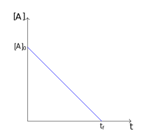
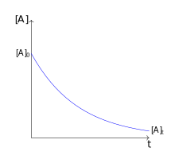

.. _s.Efnahvörf:

Efnahvörf
=========

Efnahvörf er einn gagnlegasti þáttur efnafræðinnar, enda eru efnahvörf grundvöllur lífs. En efnahvarf er ferli þar sem efni breytist; efnasambönd myndast, breytast eða brotna niður. Efnahvörfum má almennt séð lýsa sem breytingu á *efnatengjum* milli kjarna, og hægt er að skipta þeim í ýmsa flokka. Fjórir flokkar sem eru oft notaðir eru:

Álagningarhvarf (e. addition reaction)
  Þessi hvörf er þegar tvö efni sameinast og mynda eina heild, og er þá stundum talað um að annað efnið leggist á hitt. Í þessu tilfelli eru efnatengi að *myndast*.

  .. figure:: ./myndir/efnahvorf/alagning.svg
    :align: center
    :width: 30%

Brottnámshvarf (e. elimination reaction)
  Þessi hvörf er þegar eitt efni sundrast og myndar fleiri en eitt efni. Í þessum tilfelli eru efnatengi að *sundrast*

  .. figure:: ./myndir/efnahvorf/brottnam.svg
    :align: center
    :width: 30%

Skiptihvarf (e. exchange reaction)
 Þessi hvörf er þegar tvö efni skipta um hluta af sér við hvort annað. Í skiptihvörfum *sundrast* efnatengin en *myndast* svo á ný annars staðar..

 .. figure:: ./myndir/efnahvorf/skipti.svg
   :align: center
   :width: 39%

Umröðunarhvarf (e. rearrangement reaction)
  Þessi hvörf er þegar sameindir breytir stöðu atóma sinna. Í umröðunarhvörfum *sundrast* efnatengi en *myndast* svo á nýjum stað innan sameindarinnar.

  .. figure:: ./myndir/efnahvorf/umrodun.svg
    :align: center
    :width: 20%

Mól
---

Efnahvörf gerast á eindavís, t.d. ein sameind verður að annarri sameind. Eindir eru aftur á móti örsmáar og almennt ekki mjög praktískt að reikna með stökum eindum. Þess í stað er notað *mól*. Mól er fjöldi sem notað er yfir eindir, en þessi
fjöldi er skilgreindur sem fjöldi atóma í 12 grömmum af C-12 samsætunni. Þessi fjöldi er nefndur *Avogadrosartala* og hefur gildið

.. math::
  N_A=6,022 \times 10^{23}\, 1/\text{mól}.

Sumir eiga það til að flækja hugtakið í huganum, en mól lýsir einfaldlega fjölda einda líkt og kippa af bjór lýsir 6 bjórum!

Mólmassi
~~~~~~~~

Frumefnin eru mismassamikil en massi eins móls af frumefni er kallaður *mólmassi* efnisins. Mismundandi samsætur hafa vissulega mismunandi mólmassa en notað er vegið meðaltal þeirra og það má sjá í flestum lotukerfum, undir nafninu. Þessi tala er notuð fyrir
alla mólreikninga, nema tilgreint sé hvaða samsæta sé notuð.

Til að finna mólmassa sameindar er einfaldlega lagt saman mólmassi allra atóma í sameindinni.

Mólmassi, massi og mól tengjast með formúlunni

.. math::
  \mathcal{M}\cdot n=m

Þar sem :math:`\mathcal{M}` er mólmassi í g/mól, :math:`n` er mólfjöldi og :math:`m` er massinn í grömmum

.. tip::

	**Hver er massi 100 trilljón sameinda af járn(II)oxíðs,** :math:`FeO`?

  Þessi spurning krefst nokkura skrefa. Fyrst þarf að finna hve mörg mól 100 trilljón sameindir eru. Hér er notast við íslensku skilgreininguna á trilljón, þ.e. :math:`1 \times 10^{18}` og borið saman við avogadrostöluna.

  .. math::

    \frac{100\cdot 1 \times 10^{18}}{6,022\times10^{23} 1/\text{mól}}=0,00166\text{ mól}

  Til að finna massa sameindanna þarf að finna mólmassa efnanna. Fyrir það er hægt að nota t.d. `Ptable <https://ptable.com/?lang=is>`_. Fyrir járn og súrefni fæst í lotukerfinu:

  .. raw:: html

    
    </head>
    <body>

    

    

      
    

    

      
    

    

    </body>

  Í sameindinni er eitt atóm af hvoru svo mólmassi efnisins er þá:

  .. math::

    \mathcal{M} = 55,845\, \text{g/mól} + 15,999 \,\text{g/mól} = 71,844\,\text{g/mól}

  Þá er hægt að finna massa eindanna:

  .. math::

    m= \mathcal{M} \cdot n = 0,00166\text{ mól} \cdot 71,844 \text{ g/mól} = 0,119 \text{ g}

  Eins og sjá má nær massi 100 trilljón sameinda ekki einu sinni einu grammi!

Mólstyrkur
~~~~~~~~~~

*Mólstyrkur* (e. molar concentration) er mæling á mólfjölda á rúmmálseiningu af lausn. Almennt er notað lítra sem rúmmálseiningu.  Þetta er oft notað fyrir jónir og þá þarf að passa að mólstyrkurinn taki mið af fjölda
jóna í sameind.

Þetta er oft táknað með :math:`C` en einnig er notað tákn eindinnar í hornklofa. Einingin er mól/L eða M, og er kölluð mólar. Þ.e. lausn sem er einn líter að rúmmáli með einu móli af uppleystu efni er kölluð *eins mólar lausn* .

Jafnan fyrir mólstyrk er:

.. math::

	C=\frac{n}{V}

Þar sem :math:`C` er mólstyrkur, :math:`n` er mólfjöldi og :math:`V` er rúmmál lausnar í lítrum.

.. warning::

	Rúmmál lausnar getur breyst við það að leysa upp efni, og nota ætti það rúmmál í jöfnunni. Ef leyst er upp föst efni s.s. sölt, má oftast nær gera ráð fyrir óbreyttu rúmmáli.
.. tip::

 **Hver er mólstyrkur magnesíums og klóríðs ef blandað er 2,00 mólum af** :math:`MgCl_2` **í 1,00 líter af vatni?**

 Hér eru tvær gerðir af eindum og því betra að tákna styrkinn með hornklofum til aðgreiningar. Í hverri sameind af :math:`MgCl_2` er ein magnesíum jón og tvær klóríð jónir. Þá er:

 .. math::

  \begin{aligned}

 	  [Mg^{2+}] &=\frac{2,00\text{ mól }MgCl_2}{1,00 L} \cdot \frac{1\text{ mól }Mg}{1\text{ mól }MgCl_2} = 2,00\,\text{M}\\
    [Cl^-] &=\frac{2,00\text{ mól }MgCl_2}{1,00 L} \cdot \frac{2\text{ mól }Cl}{1\text{ mól }MgCl_2} = 4,00\,\text{M}

  \end{aligned}

Mólalstyrkur
~~~~~~~~~~~~

*Mólalstyrkur* (e. molal concentration) svipar til mólarstyrks nema mólalstyrkur er mælieining á mólarfjölda á kíló, í stað lítra. Þetta er almennt óalgengara í efnafræði, en gott að geta gert skil á.

Fyrir vatnslausnir fást sambærilegar tölur enda eðlismassi vatns kringum 1 kg/L.

Efnaformúlur
----------------

Uppbygging efna er lýst með formúlu, og er þá helst talað um þrjár gerðir. Munurinn á þessum formúlum
er hve miklar upplýsingar um efnið þær innihalda.

Reynsluformúla (e. empirical formula)
  Þær lýsa einungis hlutfall frumefna í sameind. Þessi formúla er oft milliskref í efnagreiningu við að finna sameindarformúluna.
Sameindarformúla (e. molecular formula)
  Þær lýsa hlutfalli efna sem og fjölda af hverju og einu atómi.
Byggingarformúla (e. structural formula)
  Þær sýna myndrænt, hvernig atómin eru tengd við hvort annað, og lýsir þannig byggingu efnisins.

Ef tekið er dæmi um ediksýru, þá er reynsluformúlan hennar :math:`CH_2O` en sameindaformúlan hennar er :math:`C2H_4O_2`.
Byggingarformúla ediksýru er aftur á móti:

.. figure:: ./myndir/efnahvorf/ediksyra.png
  :width: 25%
  :align: center

Ef það á að finna hvort að reynsluformúla og sameindaformúla sameindar sé sú hin sama, þarf að komast að mólmassa sameindarinnar. Ef
mólmassi reynsluformúlunnar er sá hinn sami, eru formúlurnar þær sömu. Ef ekki, þarf að margfalda reynsluformúlu með heiltölu svo að mólmössunum beri saman.

.. tip::

 **Glúkósi er einn helsti orkugjafi líkamans, en hann hefur reynsluformúluna** :math:`CH_2O` **og mólmassa 180,156 g/mól. Hver er sameindaformúla glúkósa?**

 Hér er fyrsta skrefið að finna mólmassa reynsluformúlunnar. Sambærilega og í dæmi á undan fæst mólmassinn:

 .. math::

  \begin{aligned}
  \mathcal{M}_{RF}&= \mathcal{M}_{C}+2\mathcal{M}_H+\mathcal{M}_O\\
  &=12,011 \text{ g/mól} + 2(1,008 \text{ g/mól})+ 15,999 \text{ g/mól}\\
  &= 30,026 \text{ g/mól}
  \end{aligned}

 Nú þarf að bera saman mólmassa sameindarinnar og reynsluformúlunnar:

 .. math::

  \frac{\mathcal{M}_{S}}{\mathcal{M}_{RF}}=\frac{180,156 \text{ g/mól}}{30,026 \text{ g/mól}}=6

 Það þarf því greinilega að margfalda reynsluformúluna í gegn með 6 til að fá sameindaformúluna. Sameindaformúlan er
 þá :math:`C_6H_{12}O_6`

Stilla efnajöfnur
-----------------

*Hvarfefni* (e. reactant) hvarfast og mynda *myndefni* (e. product), en þau gera þetta í fastákveðnum mólhlutföllum. Þetta er til að viðhalda
sama fjölda af hverju atómi í gegnum hvarfið. *Efnajafna* lýsir hvaða efni hvarfast og hvað efni myndast, en það er kallað að *stilla* efnajöfnuna
að ákvarða þessi hlutföll.

Fyrir einföld efnahvörf er þetta oft gert með prufun, en einnig er hægt að beita kerfisbundanari aðferðum fyrir flóknari efnajöfnur. Fyrir *oxunar-afoxunarhvörf*
flækist málið en það fær að bíða betri tíma.

Bruni
~~~~~

*Bruni* er í grunninn bara annað orð yfir *oxun*, þ.e. hvarf við súrefni. Algengast er að brenna kolefniskeðjur, t.d. bensín og tré, en vissulega eru mun fleiri frumefni sem brenna. Bruni á kolefniskeðjum hefur oftast nær sambærilega efnajöfnu, þ.e.
kolefniskeðjan og súrefnissameindir hvarfast og mynda vatn og koldíoxíð.

.. warning::

	Þetta gerir ráð fyrir *fullkomnum bruna* en almennt má gera ráð fyrir því.

.. tip::

	**Líkaminn fær orku úr glúkósa með að brenna hann. Settu upp efnajöfnu fyrir *bruna* glúkósa og stilltu.**

  Óstillta efnajafnan er:

  .. math::

    C_6H_{12}O_6 + O_2 \rightarrow CO_2 + H_2O

  Nú getur verið gott að setja upp töflu með fjölda frumefna á hvorri hlið:

  .. math::
    \begin{array}{ c | c | c  }
    & \text{Hvarfefni} & {Myndefni}\\
    \hline
    C& 6 & 1 \\
    O& 8 & 3 \\
    H& 12&2 \\
    \end{array}

  Þegar á að stilla er gott að byrja á þeim frumefnum sem koma sem sjaldnast fyrir hvorum megin. Hérna væri það vetni og kolefni. Það þarf 6 sinnum fleiri vetni og kolefni myndefnamegin, til að jafna út fjöldann þeirra. Því er sett stuðulinn 6 fyrir framan bæði vatn og koldíoxíð,
  og þá fæst:

  .. math::

    C_6H_{12}O_6 + O_2 \rightarrow 6 CO_2 + 6 H_2O

  Taflan verður þá:

  .. math::
    \begin{array}{ c | c | c  }
    & \text{Hvarfefni} & \text{Myndefni}\\
    \hline
    C& 6 & 6 \\
    O& 8 & 18 \\
    H& 12& 12 \\
    \end{array}

  Gott er að geyma einatóma sameindir þangað til seinast, því nú er lítið mál að laga magnið af súrefni. Það greinilega vantar 10 atóm af súrefni hvarfefnamegin og því er kippt í liðinn með því að bæta við 5 súrefnissameindum:

  .. math::

    C_6H_{12}O_6 + 6 O_2 \rightarrow 6 CO_2 + 6 H_2O

  Þessi efnajafna er nú stillt! Til að brenna mól af glúkósa þarf 6 mól af súrefnissameindum.

Sameinuð efnahvörf
------------------

Efnahvörf geta gerst í skrefum þar sem hvert skref hefur efnaformúlu. Þá er hægt að taka saman þessi skref og mynda heildarformúlu. Ef efni kemur fyrir oftar en einu sinni, sömu megin við örina, *leggjast stuðlar þess saman*. Ef efni koma sitthvorum megin
við örina, *styttast þeir út á móti hvor öðrum*.

Þetta getur gilt fyrir hvörf sem gerast í skrefum sem og hvörf sem hafa *hliðarhvörf*, þ.e. annað hvarf sem gerist samhliða.

.. math::

  \begin{aligned}
  A+2B&\rightarrow C + D\\
  C+ B &\rightarrow E
  \end{aligned}

Heildarformúlan fyrir þetta hvarf væri þá:

.. math::

  A + 3B \rightarrow D + E

Takmarkandi hvarfefni
---------------------

Þegar efnahvörf eru framkvæmd, er sjaldan blandað eftir nákvæmu *hvarfefnahlutfalli* (e. stoichiometric ratio). Því í stað er annað efnið oftast í yfirmagni (e. excess), til að tryggja betri nýtingu á öðru hráefninu. T.d. væri ekki vitlaust að blanda
7 eða fleiri mólum af súrefni fyrir hvert mól af glúkósa, í stað 6. Þetta tryggir það að glúkósinn brennur allur, eða a.m.k. meira af honum. Efnið sem nær ekki þessu hvarfefnahlutfalli, í þessu tilfelli glúkósinn, kallast *takmarkandi hvarfefnið* (e. limited reactant).
Ef einungis væri blandað 5 mólum eða færri af súrefni fyrir hvert mól af glúkósa, væri súrefnið takmarkandi hvarfefnið.

Þegar takmarkandi hvarfefnið er uppurið, getur ekki myndast meira af myndefnunum. *Mólfjöldi takmarkandi hvarfefnisins stjórnar því mólfjölda myndefna*. Algengt er að dýrara hvarfefnið sé einnig takmarkandi hvarfefnið.

Til að vita hvaða efni er takmarkandi hvarfefnið, þarf að vita mólfjölda hvarfefnanna og stillta efnajöfnu hvarfsins.

.. tip::

 **Framleiðsla á ammóníaki,** :math:`NH_3` **er eitt mikilvægasta efnahvarf heims, enda er það grunnur í flesta áburði. Það er gert með því að blanda saman nitri úr andrúmsloftinu,** :math:`N_2` **við vetnisgas,** :math:`H_2`. **Hver er hámarksmassi sem getur myndast af ammóníaki,
 ef blandað er saman 263,0 grömmum af nitri og 50,0 grömmum af vetnisgasi?**

 Stillt efnajafna fyrir hvarfinu er:

 .. math::

   N_2 + 3H_2 \rightarrow 2NH_3

 Það þarf því þrjú mól af vetni fyrir hvert mól af nitri. Byrjum á að finna mólfjölda af hvarfefnunum. Mólmassi þeirra er:

 .. math::
  \begin{aligned}
  \mathcal{M}_{H_2}&=2\cdot 1,008 \text{ g/mól} =2,016 \text{g /mól}\\
  \mathcal{M}_{N_2}&=2\cdot 14,007 \text{ g/mól} =28,014 \text{g /mól}
  \end{aligned}

 Þá er hægt að finna mólfjölda hvarfefnanna:

 .. math::
  \begin{aligned}
  n_{H_2} &= \frac{m_{H_2}}{\mathcal{M}_{H_2}} = \frac{50,0 \text{g}}{2,016 \text{ g/mól}}= 24,80 \text{ mól}\\
  n_{N_2} &= \frac{m_{N_2}}{\mathcal{M}_{N_2}} = \frac{263,0 \text{g}}{28,014 \text{ g/mól}}= 9,388 \text{ mól}
  \end{aligned}

 Jafnvel þótt fjöldinn af vetnismólum sé meiri, er hann ekki þrefalt meiri. Þ.e. :math:`\frac{24,8}{3}=8,27<9,388`.

 Vetnið er því takmarkandi hvarfefnið, og skv. efnajöfnunni myndast 2 mól af ammóníaki fyrir hver 3 mól af vetni. Þá getur að hámarki myndast:

 .. math::

   n_{NH_3}=24,80 \text{ mól }H_2 \cdot \frac{2 \text{ mól }NH_3}{3 \text{ mól }H_2} = 16,53 \text{ mól }NH_3

 Þessu er svo að lokum breytt í massa:

 .. math::
  \begin{aligned}
  \mathcal{M}_{NH_3}&=14,007 \text{ g/mól} + 3\cdot 1,008 \text{ g/mól} =17,031 \text{g /mól}\\
  m_{NH_3} &= \mathcal{M}_{NH_3} \cdot n_{NH_3} = 17,031 \text{ g/mól} \cdot 16,53 \text{ mól}= 282 \text{ g}
  \end{aligned}

Hraðafræði
----------

Efnahvörf gerast mishratt, og það getur verið gagnlegt að vita hvaða þættir hraða eða hægja á efnahvarfinu, og stjórna þeim eftir því hvað hentar. *Hraði* efnahvarfs er þá breyting á styrk á tíma, sambærilegt og í eðlisfræði er hraði breyting á staðsetningu á tíma.

Ef það er verið að mynda járn(II) jónir úr járn(III) jónum er hægt að skrifa hraðann sem:

.. math::

  \text{hraði} =\frac{\Delta[Fe^{2+}]}{\Delta t}=\frac{-\Delta[Fe^{3+}]}{\Delta t}

.. note::

	:math:`\Delta` er gríski bókstafurinn "Delta" og í efnafræði táknar hann *breytingu*. :math:`\Delta[Fe^{2+}]` er því breyting á styrk járn(II) jóna og er reiknaður sem lokagildi mínus upphafsgildi.

Styrkur járn(III) jóna minnkar eftir því sem líður á efnahvarfið, og :math:`\Delta[Fe^{3+}]` er því neikvæð stærð. Til þess að efnahvarf haldi áfram þarf hraðinn að vera jákvæður, og því er notað mínusmerki fyrir framan breytingu á hvarfefnum. Til að samræma þessar tölur þarf einnig að deila með mólhlutfallsstuðlinum í efnajöfnunni.

.. math::

	aA + bB \rightarrow cC +dD

Fyrir stilltu efnajöfnuna, þar sem litlu bókstafirnir eru mólhlutföllin er hraðinn:

.. math::

	\text{hraði} =-\frac{1}a\frac{\Delta[A]}{\Delta t}=-\frac{1}b\frac{\Delta[B]}{\Delta t}=\frac{1}c\frac{\Delta[C]}{\Delta t}=\frac{1}d\frac{\Delta[D]}{\Delta t}

Til að mæla hraða efnahvarfs er nóg að fylgjast með einu efni, og hægt er að reikna breytingu á styrk hinna efnanna.

.. tip::

 **Vetnisperoxíð er algengt sótthreinsefni fyrir sár, en það brotnar niður samkvæmt efnahvarfinu:**

 .. math::

   2H_2O_2\text{(aq)} \rightarrow 2H_2O\text{(l)} + O_2\text{(g)}

 **Í upphafi (t=0) var styrkur vetnisperoxíðs 0,120 M en eftir 89 sekúndur var styrkurinn 0,035M. Hver er hraði hvarfsins?**

 Hér var fylgst með vetnisperoxíðinu og því fæst:

 .. math::

   \text{hraði}= -\frac{1}{2}\frac{\Delta [H_2O_2]}{\Delta t}=-\frac{1}{2}\frac{(0,035\,\text{M}-0,120\,\text{M})}{(89\,\text{s}-0\,\text{s})}=9,55 \times 10^{-4} \text{M/s}

 Þetta er meðalhraði hvarfsins yfir þennan tíma.

Hraði getur verið breytilegur í gegnum hvarfið, og þetta er því einungis gilt til að finna meðalhraða yfir þann tíma sem var mælt. Til að finna hraðann á hverju augnabliki þyrfti að *diffra* en hraðinn er hægt að skrifa sem :math:`-\frac{1}{a} \frac{d[A]}{dt}`.
Ekki er nauðsynlegt að vera vel að sér í diffri fyrir hraðafræðina, og hún mun einungis koma fram í sönnunum hér, sem eru einungis fyrir áhugasama.

Áhrif styrks hvarfefna á hraða
~~~~~~~~~~~~~~~~~~~~~~~~~~~~~~

Hraði hvarfs getur byggst að miklu leyti á styrk ákveðins hvarfefnis, eða ekki neitt. Það fer allt eftir *hvarfgangi* (e. mechanism) hvarfsins, sem lýsir hvernig hvarfið gerist, skref fyrir skref. Þetta er ákvarðað með tilraunum þar sem breytilegt magn hvarfefna er notað. Þá er gagnlegt að setja upp formúlu sem lýsir hraða efnahvarfs.

.. math::

	aA + bB \rightarrow cC +dD

Fyrir þetta efnahvarf væri *hraðalíkanið* (e. rate expression) eftirfarandi:

.. math::

	\text{hraði}=k[A]^{m} [B]^{n}

hér er :math:`k` *hraðafasti* (e. rate constant) hvarfsins og stuðlarnir :math:`m,n` sýna *stig* (e. order) efnahvarfsins m.t.t. hvarfefnisins. Þessar tölur eru ákvarðar með tilraunum og passa skal að :math:`m,n` eru **ekki** endilega tengdir stuðlunum :math:`a,b` en klassísk villa er að rugla þeim saman. Þegar talað erum stig efnahvarfs og ekki tilgreint hvarfefni, er
lagðir saman stuðlarnir :math:`m+n`.

Þegar smíða á hraðalíkan skal hafa öll hvarfefnin, en ef veldisstuðull reynist vera 0 fyrir hvarfefni má taka það úr líkaninu.

Hraðafasti
~~~~~~~~~~

Hraðafastinn er einkennandi fyrir hvert hvarf, en hann breytist þó með *hitastigi*, en almennt gerast hvörf hraðar í heitari aðstæðum. Hraðafastinn er stundum skrifaður sem :math:`k(T)`, en táknar hraðafastann sem fall af hitastigi.

Hraðafastinn hefur mismunandi einingar fyrir mismunandi stig hvarfa. Reglan er sú að hraðinn hefur alltaf eininguna M/s, og eining hraðafastans er ákvörðuð út frá því

Núllta stigs hvarf
~~~~~~~~~~~~~~~~~~

Fyrir *núllta stigs hvörf* er hraðinn *ekki* háður neinu hvarfefni, og helst stöðugur þangað til takmarkandi hvarfefnið er uppurið. Þá er :math:`m=n=0` og hraðalíkanið verður einfaldlega:

.. math::

  \text{hraði}=k

Á grafi liti þá styrkbreyting hvarfefnis svona út:

.. note::

	Algengur ritháttur að nota undirskriftina :math:`_0` eða :math:`_i` fyrir upphafsgildi. Þetta stendur fyrir :math:`t=0` eða "initial". Að sömu leyti er einnig oft notað :math:`_f` fyrir "final" til að tilgreina lokagildi. Notað er undirskriftin :math:`_t` til að tákna gildi fyrir ákveðinn tíma :math:`t`.

Fyrir núllta stigs hvörf er auðvelt að ákvarða hraðafastann, :math:`k`, en hann, margfaldaður við :math:`a` er neikvæð hallatalan á grafinu. Þ.e.

.. math::

	a \cdot k=-\frac{[A]_f-[A]_0}{t_f-t_0}=\frac{[A]_0-[A]_f}{t_f-t_0}

Jafna línunnar á grafinu er:

.. math::

  [A]_t=-akt+ [A]_0

.. tip::

 **Gefið er að eftirfarandi efnahvarf sé núllta stigs.**

 .. math::

	  A -> B + C

 **Upphafsstyrkur A er 0,180 M, og það tekur hvarfið 4 mínútur að klárast við 25°C. Hver er hraðafastinn við 25°C?**

 Hér er hægt að nota báðar jöfnur en notum þá fyrri. Hér er :math:`[A]_0=0,180\text{ M}`, :math:`[A]_f=0 \text{ M}` og :math:`t_f=4 \text{ mín}`, :math:`t_0= 0 \text{ mín}`. Ef gildin eru upphafs- og lokagildi einfaldast jafnan í:

 .. math::

 	k=\frac{[A]_0}{t_f}=\frac{0,180 \text{ M}}{4 \text{mín}}=0,045\text{ M/mín}

 Hérna er hraðafastinn gefinn upp með einingu M/mín, en einnig væri hægt að breyta í M/sek. Enginn regla er á því hvað skal nota en oft er hægt að meta bestu eininguna út frá stærðargráðu fastans.

Fyrsta stigs hvarf
~~~~~~~~~~~~~~~~~~

Hvarf er *fyrsta stigs* (e. first order) þegar hraðinn byggist á styrk hvarfefnis í fyrsta veldi.

.. math::

  aA + bB -> cC

Hraðalíkanið fyrir þetta hvarf væri þá:

.. math::

  \text{hraði}=k[A]^m [B]^n

þar sem :math:`m+n=1`. Oftast nær er önnur talan 0 og hraðalíkanið þá :math:`\text{hraði}=k[A]` eða :math:`\text{hraði}=k[B]`. Í jöfnum hér á eftir var A valið sem hvarfefni sem hraðinn er háður, en sambærilegt gildir fyrir B.

Styrkur sem fall af tíma er ekki lengur línulegur heldur gildir jafnan:

.. math::

  \text{ln}([A]_t)=-a k t +\text{ln}([A]_0)

.. begin-toggle::
  :label: Sönnun
  :starthidden: True

**Ekki þarf að kunna sannanir og er fyrst um sinn einungis fyrir áhugsama**

Fyrir fyrsta stigs hvarf gildir:

.. math::

  \text{hraði} =-\frac{1}a\frac{d[A]}{dt}=k[A]

Þetta er aðgreinanleg diffurjafna sem hægt er að heilda:

.. math::

  \int_{[A]_0}^{[A]_t} \frac{d[A]}{[A]}=\int_{0}^{t} -ak

Með því að heilda báðum megin fæst svo jafnan:

.. math::

  \text{ln}([A]_t)-\text{ln}([A]_0) =-akt

.. end-toggle::

Efnahvarfið hægir þá á sér eftir því sem líður á.

.. tip::

  **Borðsykur, eða súkrósi er tvísykra sem brotnar niður í líkamanum í glúkósa og frúktósa skv. efnajöfnunni:**

  .. math::

    C_{12}H_{22}O_{11} + H_2O \rightarrow C_6H_{12}O_6 + C_6H_{12}O_6

  **Þetta er fyrsta stigs hvarf með hraðafasta** :math:`2,3 \times 10^{-5}\text{ 1/s}` við 15 °C. **Hver er styrkur súkrósalausnar 136 mínútum inn í hvarfið, ef hún hafði upphafsstyrk 0,010 M?**

  Hérna, líkt og í mörgum dæmum er :math:`a=1` og þarf því ekki að hugsa nánar út í það. Þá þarf bara að stinga inn gildunum í jöfnuna fyrir ofan og þá fæst:

  .. math::

    \begin{aligned}
      \text{ln}([C_{12}H_{22}O_{11}] _{t=6 \text{ mín}}) &= - 2,3 \times 10^{-5} \text{ 1/s}\cdot 136\text{ mín}  \cdot \frac{60 \text{ s}}{1 \text{ mín}} + \text{ln}(0,010\text{ M})\\
      &=-4,7929\\
    \end{aligned}

  Til að losna við lografallið er tekið *veldisvísifallið*:

  .. math::

    \begin{aligned}
      {[C_{12}H_{22}O_{11}]}_{t=6 \text{ mín}} &=e^{-4,7929}\\
      &=0.0083 M
    \end{aligned}

Annars stigs hvarf
~~~~~~~~~~~~~~~~~~

Hvarf er *annars stigs* (e. second order) þegar hraðinn byggist á styrk hvarfefna í öðru veldi.

.. math::

  aA + bB -> cC

Hraðalíkanið fyrir þetta hvarf væri þá:

.. math::

  \text{hraði}=k[A]^m [B]^n

þar sem :math:`m+n=2`. Algengustu annars stigs hvarfslíkön eru :math:`k[A]^2`, :math:`k[B]^2` eða :math:`k[A][B]`. Fyrir fyrstu tvö líkönin er hægt að leiða út jöfnuna fyrir styrk:

.. math::

  \frac{1}{[A]_t}=akt + \frac{1}{[A]_0}

Ákvarða stig hvarfefnis
~~~~~~~~~~~~~~~~~~~~~~~

Til að ákvarða stig hvarfefnis í hraðalíkanið, þ.e. stuðlana :math:`m,n`, þarf tilraunir. Þá er blandað saman mismunandi styrk af hvarfefnum og athuga hvernig það hefur áhrif á hraðann.

.. math::

  A+B \rightarrow C

Fyrir þetta efnahvarf væri hraðalíkanið

.. math::

  \text{hraði} = k[A]^m[B]^n

Segjum sem svo að hraðinn er mældur tvisvar og í seinna skiptið er notað tvöfaldan styrk af hvarfefni :math:`A`. Þá er hægt að finna stuðulinn :math:`m` með jöfnunni:

.. math::

  \frac{\text{hraði}(2\times A)}{\text{hraði}(1\times A)}=2^m

Þessi jafna er fyrir þegar tvöfaldað er styrkinn af hvarfefni A. Ef notað er :math:`x` sinnum meiri styrk af hvarfefninu, er jafnan:

.. math::

  \frac{\text{hraði}(x\times A)}{\text{hraði}(1\times A)}=x^m

.. begin-toggle::
    :label: Sönnun
    :starthidden: True

Ef notað er :math:`x` sinnum meira af hvarfefni A er styrkurinn :math:`x[A]`. Hraðalíkanið verður þá:

.. math::

  \require{cancel}

  \begin{aligned}
  \text{hraði}&=k(x[A])^m[B]^n\\
  &=kx^m[A]^m[B]^n
  \end{aligned}

Þetta er hægt að deila í hraðalíkanið sem fæst fyrir upphaflega magnið af hvarfefni A:

.. math::

    \begin{aligned}
    \frac{\text{hraði}(x\times A)}{\text{hraði}(1\times A)}&=\frac{\bcancel{k} x^m\bcancel{[A]^m}\bcancel{[B]^n}}{\bcancel{k}\,\,\,\,\,\,\,\bcancel{[A]^m}\bcancel{[B]^n}}\\
     &=x^m
    \end{aligned}

.. end-toggle::

Þessar jöfnur geta litið flóknar út og því gæti verið auðveldara að skilja þetta í dæmi.

.. tip::

 **Mældur var hraðinn fyrir efnahvarfið með mismunandi styrk hvarfefna**

 .. math::

  	A+ B \rightarrow C

 **Niðurstöðurnar voru settar upp í töflu:**

 .. math::

  	\begin{array}{c|c|c}
    [A]&[B]& \text{hraði} [\text{M/s}]\\
      \hline
    0.100\text{ M}&0.100\text{M}&1,2\times 10^{-4}\\
    0.200\text{ M}&0.100\text{M}&2,4\times 10^{-4}\\
    0.100\text{ M}&0.300\text{M}&10,8\times 10^{-4}\\
    \end{array}

 **Hvert er hraðalíkan hvarfsins? Finndu hraðafastann, sem og stuðlana** :math:`m,n`.

 Almenna hraðalíkan hvarfsins er

 .. math::

   \text{hraði}=k[A]^m[B]^n

 Til að finna :math:`m` er hægt að athuga hvað gerist þegar styrkur A er *tvöfaldaður*. Það sem gerist er að hraðinn *tvöfaldast*. Þá er:

 .. math::

 	2 = 2^m

 Þetta gefur að :math:`m=1`. Athugum nú hvað gerist þegar styrkur A er *þrefaldaður*. Það sem gerist er að hraðinn *nífaldast*. Þá er:

 .. math::

  9= 3^n

 Þetta gefur að :math:`n=2`. Hraðalíkanið er þá orðið:

 .. math::

 	\text{hraði}=k[A][B]^2

 Hvarfið er þá þriðja stigs. Til að finna hraðafastann, er hægt að nota hvert og eitt gildi. Notum það fyrsta og stingum inn gildunum í hraðalíkanið:

 .. math::

  1,2\times 10^{-4} \text{ M/s}= k \cdot 0.100 \text{ M}\cdot (0.200 \text{ M})^2

 Endurritum þetta og þá fæst:

 .. math::

  \begin{aligned}

    k&=\frac{1,2\times 10^{-4} \text{ M/s}}{0.100 \text{ M}\cdot (0.200 \text{ M})^2}\\
     &=0,030 \text{ s}^{-1}\text{ M}^{-2}

  \end{aligned}
